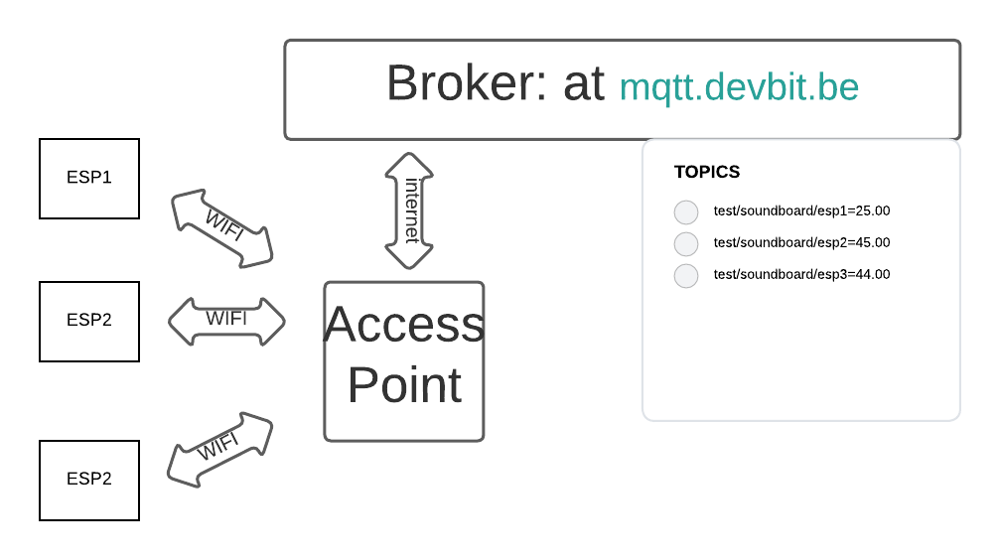

## Important parts of the code

### We take as example the Code of EXP1:

The needed ssid and password to connect to access point

```CPP
const char* ssid      = "<WIFI-ssid>";
const char* password  = "<password>";
```

We connect to the broker mqtt.devbit.be, we publisch to
test/soundboard/esp1. We declare an client ID soo the socket knows what unical client it is.

```CPP
const char* mqtt_server = "mqtt.devbit.be";
const char* sensor_topic = "test/soundboard/esp1"; 
const char* mqtt_username = "test_esp1"; 
const char* mqtt_password = "test_esp1"; 
const char* clientID = "client_soundboard_esp1"; 
```

```CPP
const char* mqtt_server = "mqtt.devbit.be";
const char* sensor_topic = "test/soundboard/esp1"; 
const char* mqtt_username = "test_esp1"; 
const char* mqtt_password = "test_esp1"; 
const char* clientID = "client_soundboard_esp1"; 
```

Inside **void Setup** we publish ur value to the socket. We convert the float in a type string.

```CPP
 if (client.publish(sensor_topic, String(distance_cm).c_str())) {
    Serial.println("distance sent!");
  }
```

We have tree modules and every module publish a value to an topic.



### Publisch links

We have 2 subscribe functions one status and other one sensor values.

We get all the values of the availabel devices under this link.

"test/devices/"
"test/devices/58:CF:79:E3:62:70"
"test/devices/58:CF:80:E3:62:70"
...

for example: When we publisch to test/58:CF:79:E3:7F:A4/status

if an 1 or a 0 is send, we control when we start reading the sensor values.

### Mqtt subcribe links

We can start reading the values when we subcribe to the mac addres

58:CF:79:E3:62:70/sensor